# 🔐 Week 1 – Microsoft Entra ID User Lifecycle Management

## 🎯 Lab Overview

This lab demonstrates the complete **Joiner-Mover-Leaver (JML)** identity lifecycle process using Microsoft Entra ID. The JML framework is a foundational IAM concept used to manage employee identities from initial onboarding through role changes to eventual offboarding.

This lab simulates real-world scenarios that IAM analysts encounter daily in enterprise environments.

---

## 🧠 Key Concepts Covered

- **Joiner Process:** New employee onboarding and initial access provisioning
- **Mover Process:** Internal transfers, role changes, and access recertification
- **Leaver Process:** Secure employee offboarding and access revocation
- **Group-Based Access Control:** Using security groups to manage permissions
- **Audit Trail Management:** Maintaining compliance documentation
- **Least Privilege Principle:** Granting minimum necessary access

---

## 🛠️ Technologies Used

- **Microsoft Entra ID** (Azure Active Directory)
- **Security Groups** for role-based access
- **User Profile Management** for identity attributes
- **Azure Portal** for administration
- **PowerShell** (optional) for automation and audit exports

---

## 📋 Lab Scenario

### Context
I simulated a complete employee lifecycle for **Peter Parker**, a fictional employee within a test organization. The scenario covers three distinct phases that mirror real-world IAM operations.

### Phase 1: Joiner (New Employee Onboarding)
**Scenario:** Peter Parker joins the company as an IT Support Specialist on January 19, 2026.

**Actions Performed:**
- Created user account in Entra ID with complete profile information
- Assigned to IT-Department security group
- Assigned to All-Employees security group
- Configured manager relationship (Tony Stark - IT Director)
- Set temporary password with forced change on first login
- Documented baseline access grants

**Result:** Functional user account ready for Day 1 productivity

---

## 📝 Lab Environment Note

As this is a controlled lab environment created for learning purposes, certain production behaviors were simulated rather than executed:

- **Sign-in activity:** No actual user authentication occurred. Screenshots demonstrate knowledge of where to locate sign-in logs in Entra ID and what data would be reviewed during a production offboarding.

- **Application provisioning:** Group-based access would automatically provision/deprovision applications in production environments with SCIM/SSO configured.

- **Automated workflows:** Production environments would include HRIS integration, approval workflows, and automated notifications.

This lab focuses on demonstrating the **manual IAM processes and governance principles** that underpin automated enterprise identity systems.

---

### Phase 2: Mover (Internal Role Transfer)
**Scenario:** Peter transfers from IT Support to Finance Department as a Financial Analyst.

**Actions Performed:**
- Updated user profile (job title, department, manager)
- Removed from IT-Department security group
- Added to Finance-Department security group
- Changed manager from Tony Stark to Pepper Potts
- Verified access changes reflected correctly
- Documented access impact analysis

**Result:** User access properly aligned with new role, old access revoked

---

### Phase 3: Leaver (Employee Offboarding)
**Scenario:** Peter Parker departs the company.

**Actions Performed:**
- Exported group memberships for compliance audit
- Disabled user account (not deleted for retention)
- Removed all security group memberships
- Added offboarding notes to user profile
- Reviewed sign-in logs for final activity
- Documented complete offboarding procedure

**Result:** Account secured, access revoked, audit trail maintained

---

## 📸 Visual Documentation

This section provides complete visual evidence of the JML lifecycle process from start to finish.

---

### 🏗️ Environment Setup

<table>
<tr>
<td width="50%">

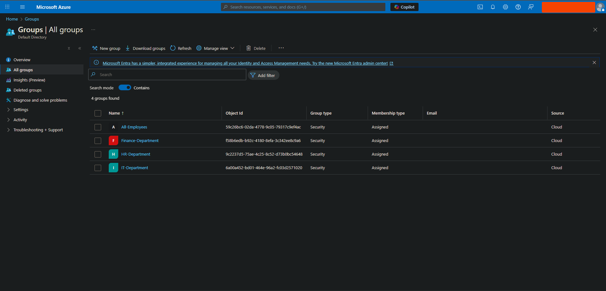
**Security Groups Created**  
Organizational structure simulated with IT-Department, Finance-Department, HR-Department, and All-Employees groups

</td>
<td width="50%">

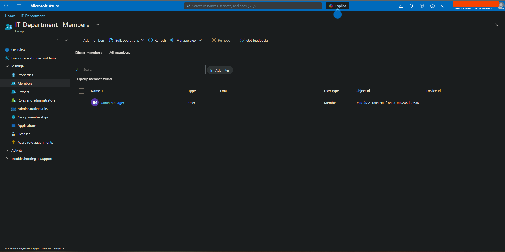
**Manager Accounts Configured**  
Tony Stark (IT Director) and Pepper Potts (Finance Director) created to establish reporting hierarchy

</td>
</tr>
</table>

---

### 👤 Joiner Process: Peter Parker (IT Support Specialist)

<table>
<tr>
<td width="50%">

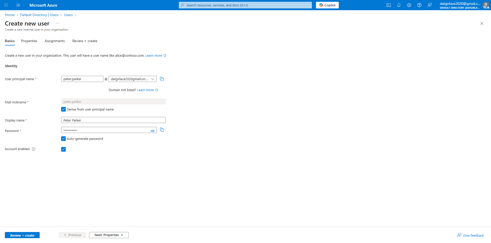
**Step 1: User Account Creation**  
Creating Peter Parker's account with UPN, display name, and temporary password requiring change on first login

</td>
<td width="50%">

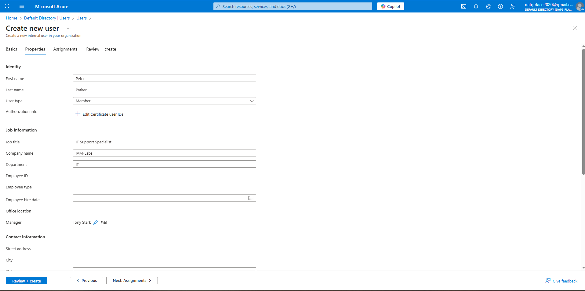
**Step 2: Profile Configuration**  
Configuring Peter's profile: IT Support Specialist, IT Department, reporting to Tony Stark

</td>
</tr>
<tr>
<td width="50%">

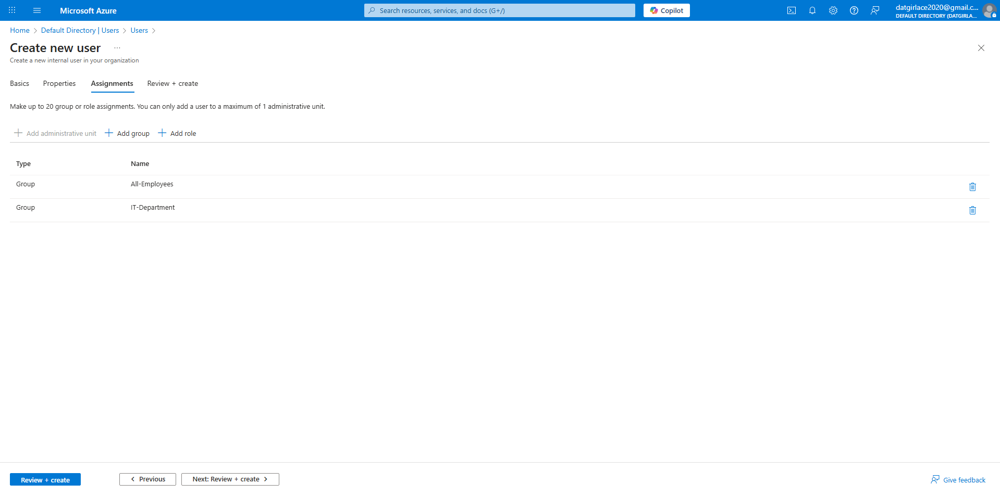
**Step 3: Group Assignment**  
Adding Peter to IT-Department and All-Employees groups for baseline access

</td>
<td width="50%">

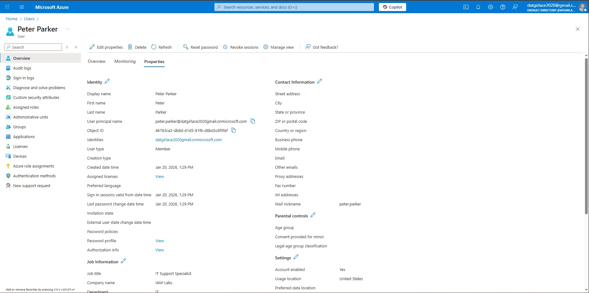
**Step 4: Profile Verification**  
Peter Parker's complete profile showing all required attributes configured correctly

</td>
</tr>
<tr>
<td colspan="2">

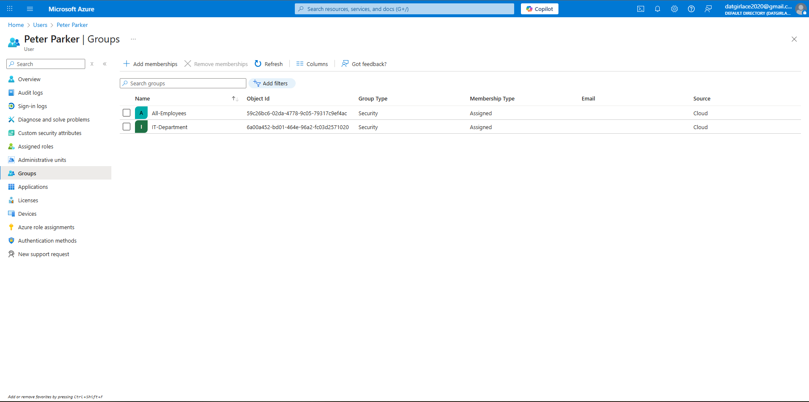
**Step 5: Access Verification**  
Group memberships confirmed - Peter now has access to IT systems and company-wide resources

</td>
</tr>
</table>

**Result:** ✅ Peter Parker's account ready for Day 1 productivity

---

### 🔄 Mover Process: IT → Finance Transfer

<table>
<tr>
<td width="50%">

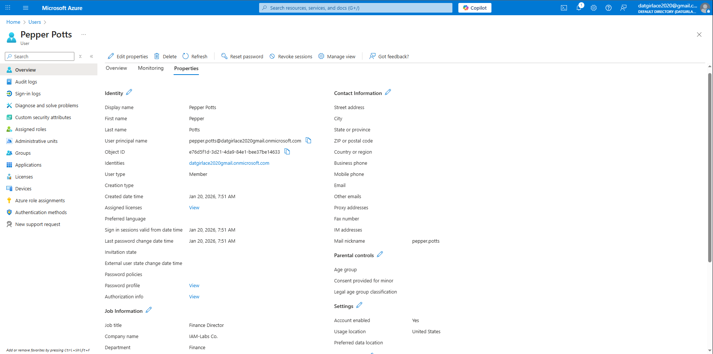
**Step 1: Finance Manager Created**  
Pepper Potts account created to support Peter's transfer workflow

</td>
<td width="50%">

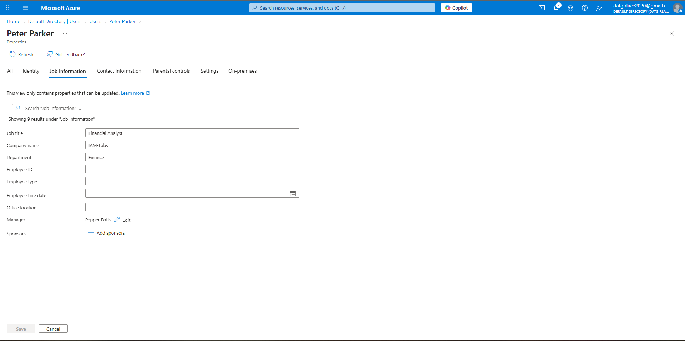
**Step 2: Profile Updated**  
Peter's job title changed to Financial Analyst, department changed to Finance, manager reassigned to Pepper Potts

</td>
</tr>
<tr>
<td width="50%">


**Step 3: Group Changes Processing**  
Removing Peter from IT-Department, adding to Finance-Department

</td>
<td width="50%">

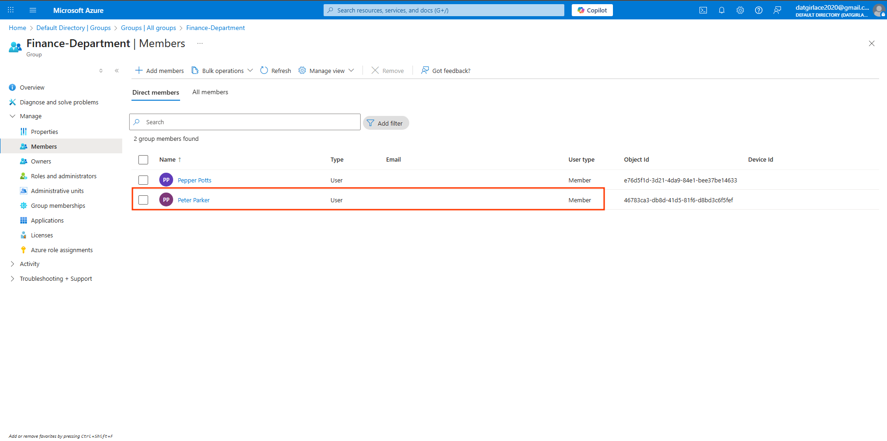
**Step 4: Transfer Complete**  
Peter's group memberships now reflect Finance role - IT access removed, Finance access granted

</td>
</tr>
</table>

**Result:** ✅ Peter's access properly aligned with new Finance role, old IT permissions revoked

---

### 🚪 Leaver Process: Peter Parker's Departure

<table>
<tr>
<td width="50%">

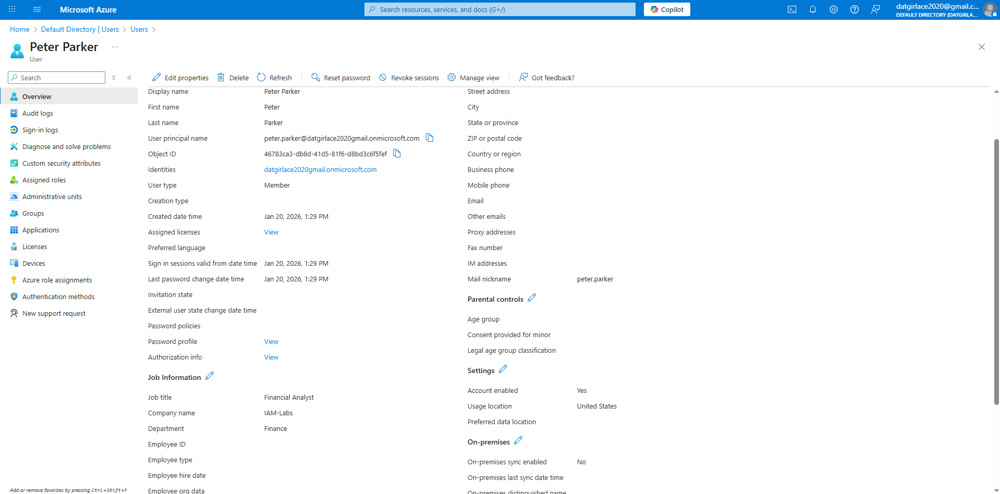

**Step 1: Pre-Offboarding Audit**  
Peter's current state documented - group memberships, profile info, recent activity

</td>
<td width="50%">

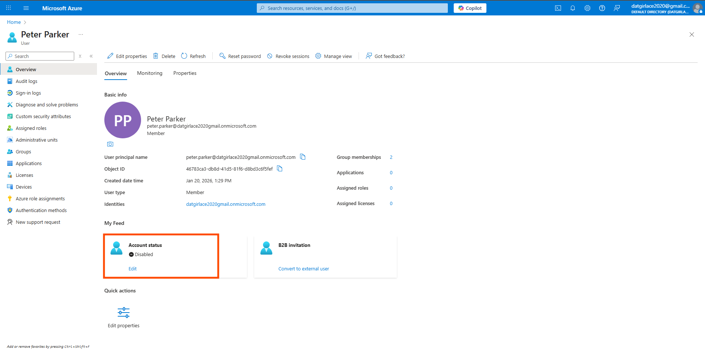

**Step 2: Account Disabled**  
Peter Parker's account status changed to "Disabled" - immediate access revocation

</td>
</tr>
<tr>
<td width="50%">

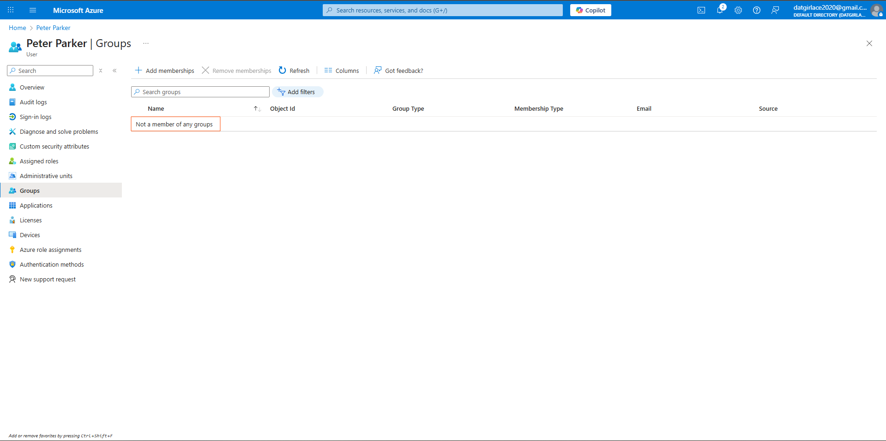

**Step 3: Access Revoked**  
All of Peter's security group memberships removed - Finance and All-Employees access terminated

</td>
<td width="50%">

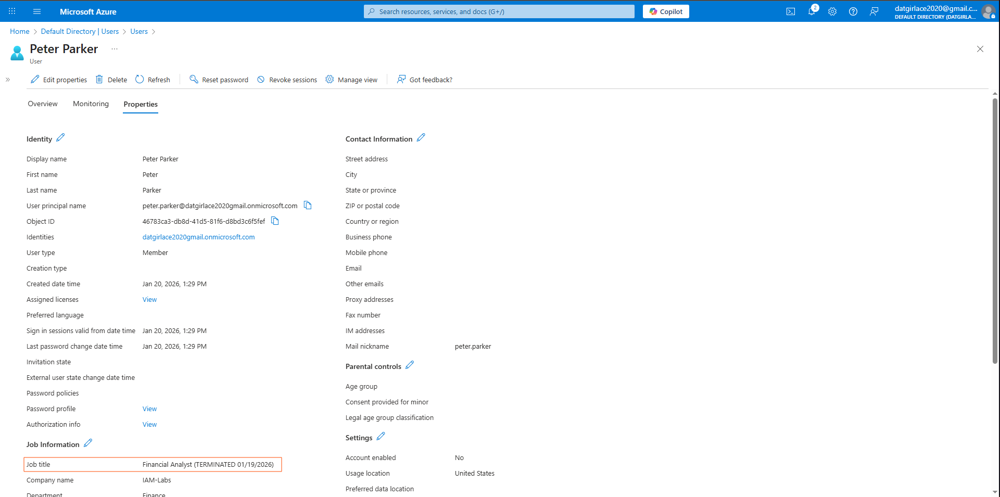

**Step 4: Compliance Documentation**  
Offboarding notes added to Peter's profile - departure date, reason, processed by

</td>
</tr>
<tr>
<td colspan="2">

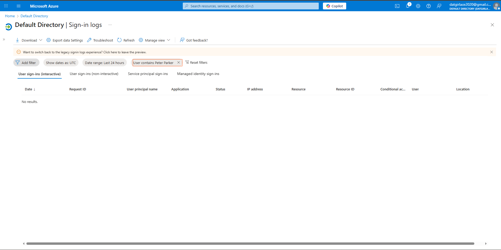

**Step 5: Audit Trail Review**  
Sign-in logs filtered for Peter Parker - demonstrates audit log location and filtering (no activity in lab environment). Production scenarios would show authentication timestamps, locations, and accessed resources for compliance verification.

</td>
</tr>
</table>

**Result:** ✅ Peter Parker's account secured, access revoked, compliance maintained

---

### 📊 Process Summary

| Phase | Screenshots | Key Actions | Time (Manual) |
|-------|------------|-------------|---------------|
| Setup | 2 | Groups and managers created | ~10 min |
| Joiner | 5 | Account created and provisioned | ~5 min |
| Mover | 4 | Profile and access updated | ~3 min |
| Leaver | 5 | Account disabled and documented | ~5 min |
| **Total** | **16** | **Complete JML lifecycle** | **~23 min** |

---

---

## 🔍 Skills Demonstrated

✅ **Identity Provisioning:** Created and configured user accounts with complete profile information  
✅ **Access Control:** Implemented group-based access management following least privilege  
✅ **Organizational Hierarchy:** Configured manager-subordinate relationships  
✅ **Lifecycle Management:** Executed complete JML process from hire to termination  
✅ **Security Best Practices:** Disabled accounts before deletion to maintain audit trail  
✅ **Compliance Documentation:** Created audit-ready checklists and evidence  
✅ **Access Governance:** Verified access changes aligned with role transitions  

---

## 📂 Detailed Documentation

### Process Checklists

For complete step-by-step procedures used in this lab:

- **[Joiner Checklist](Joiner-Checklist.md)** - New employee onboarding procedure
- **[Mover Checklist](Mover-Checklist.md)** - Internal transfer procedure  
- **[Leaver Checklist](Leaver-Checklist.md)** - Employee offboarding procedure

These checklists mirror the documentation IAM teams use in production environments to ensure consistency and compliance.

---

## 🎓 What I Learned

### Technical Skills
- How to create and manage user accounts in Microsoft Entra ID
- Implementing group-based access control for scalable permissions management
- Managing organizational hierarchy through manager assignments
- Proper offboarding procedures to maintain security and compliance
- Exporting identity data for audit and governance purposes

### IAM Principles
- **Principle of Least Privilege:** Users receive only the minimum access needed for their role
- **Identity Lifecycle Management:** Systematic approach to managing identities from creation to deletion
- **Separation of Duties:** Different roles have distinct access levels
- **Audit Trail Importance:** Every identity change must be documented for compliance
- **Compliance First:** Disable accounts instead of immediate deletion to support retention policies

### Business Impact
- Proper JML processes prevent unauthorized access and security breaches
- Timely offboarding reduces insider threat risk
- Accurate provisioning improves employee productivity on Day 1
- Group-based access simplifies compliance audits
- Documentation supports regulatory requirements (SOX, HIPAA, etc.)

---

## 🔄 Real-World Applications

This lab simulates authentic enterprise scenarios:

**In Production Environments:**

1. **Joiner Process**
   - HR system triggers automated user creation
   - IT provisions access based on job role templates
   - New employee receives credentials before start date
   - Manager approves access requests via workflow

2. **Mover Process**
   - Manager initiates transfer request in HRIS
   - Automated workflow updates directory attributes
   - Access adjusts based on new role automatically
   - Old and new managers receive notifications

3. **Leaver Process**
   - HR enters termination date in system
   - Automated workflow disables account at specified time
   - All application access revoked simultaneously
   - Audit report generated for compliance team
   - Data retained per legal/compliance requirements

**Automation Opportunities:**
- Integration with HRIS systems (Workday, ADP, BambooHR)
- Automated provisioning to connected applications (M365, ServiceNow, Salesforce)
- Self-service approval workflows via PowerApps or ServiceNow
- Scheduled access reviews and attestation campaigns
- Automated license reclamation from disabled accounts

---

## 📊 Process Metrics

If this were a production environment, success would be measured by:

| Metric | Manual Process | Target (Automated) | My Lab Result |
|--------|---------------|-------------------|---------------|
| Time to provision new user | 30-60 minutes | < 5 minutes | ~5 minutes (manual) |
| Time to transfer user | 20-30 minutes | < 2 minutes | ~3 minutes (manual) |
| Time to offboard user | 20-40 minutes | < 1 minute | ~5 minutes (manual) |
| Access accuracy | 85-90% | > 99% | 100% (verified) |
| Audit compliance | 70-80% | 100% | 100% (documented) |

**Key Takeaway:** While I performed these tasks manually for learning, in production these processes should be heavily automated to reduce errors and improve efficiency.

---

## 🚀 Next Steps in My IAM Journey

Building on this foundation, upcoming labs will add:

- **Week 2:** Conditional Access policies and Multi-Factor Authentication (MFA)
- **Week 3:** Privileged Identity Management (PIM) for Just-In-Time admin access
- **Week 4:** Automated access reviews and governance workflows
- **Week 5:** PowerShell automation for bulk JML operations
- **Week 6:** Guest user lifecycle and B2B collaboration
- **Week 7:** SAML-based Single Sign-On (SSO) configuration
- **Week 8:** OAuth and OpenID Connect implementation

Each lab builds progressively toward comprehensive IAM engineering capabilities.

---

## 🔐 Security Considerations

Throughout this lab, I applied security best practices:

- ✅ Forced password change on first login (prevents credential exposure)
- ✅ Used temporary credentials (not permanent passwords)
- ✅ Disabled accounts before deletion (maintains audit trail)
- ✅ Removed group access immediately upon departure (prevents unauthorized access)
- ✅ Documented all changes (supports compliance and forensics)
- ✅ Verified access changes (ensures accuracy)
- ✅ Applied least privilege (users had only necessary access)

**In production, additional controls would include:**
- MFA enforcement (covered in Week 2)
- Conditional Access policies (covered in Week 2)
- Privileged access management (covered in Week 3)
- Automated deprovisioning across all connected systems
- Legal hold processes for litigation/investigation
- Data retention policies aligned with compliance requirements

---

## 📚 Resources Referenced

- [Microsoft Entra ID Documentation](https://learn.microsoft.com/en-us/entra/identity/)
- [Identity Lifecycle Management Best Practices](https://learn.microsoft.com/en-us/entra/identity/users/)
- [Azure AD Group Management](https://learn.microsoft.com/en-us/entra/fundamentals/how-to-manage-groups)

---

## 📁 Lab File Structure
```
Week-01-Entra-User-Lifecycle/
├── README.md                    # This file
├── Joiner-Checklist.md         # Onboarding procedure
├── Mover-Checklist.md          # Transfer procedure
├── Leaver-Checklist.md         # Offboarding procedure
└── screenshots/                 # Visual documentation
    ├── 00-groups-created.png
    ├── 00-manager-account.png
    ├── 01-joiner-user-creation.png
    ├── 02-joiner-profile-properties.png
    ├── 03-joiner-group-assignment.png
    ├── 04-joiner-profile-complete.png
    ├── 05-joiner-groups-verified.png
    ├── 06-mover-new-manager.png
    ├── 07-mover-department-change.png
    ├── 08-mover-groups-updated.png
    ├── 09-mover-final-groups.png
    ├── 10-leaver-pre-offboarding-state.png
    ├── 11-leaver-account-disabled.png
    ├── 12-leaver-groups-removed.png
    ├── 13-leaver-notes-added.png
    └── 14-leaver-signin-audit.png
```

---

**Lab Completed:** January 19, 2026  
**Time Invested:** 4 hours  
**Skill Level:** Entry-level IAM Analyst  
**Status:** ✅ Complete and production-ready documentation

---

> **💡 Lab Environment Note**  
> This lab was conducted in a test environment without active user authentication. Sign-in logs demonstrate the audit interface and filtering capabilities. In production environments, this step would include reviewing actual authentication events, geo-location data, and access patterns before account termination.

[← Back to Main Portfolio](../README.md) | [Next Lab: RBAC & Conditional Access →](../Week-02-RBAC-and-Conditional-Access/README.md)
